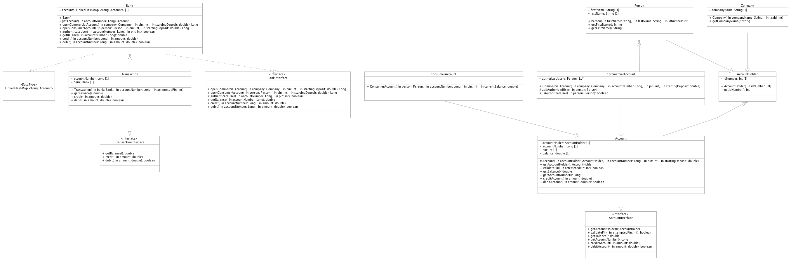

# About
The project provides a simple, thread-safe, scalable and extensible banking system with functionality to perform common banking operations like account creation, balance checks, and transactions. It features an abstract Account class, a Bank class for managing multiple accounts, ability to create commercial account or personal account, and unit tests to validate the functionality. 

